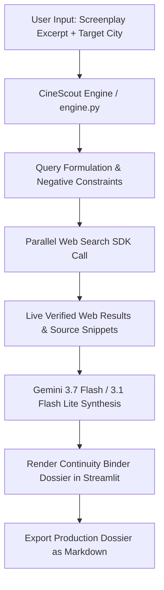

# CineScout: Autonomous Film Pre-Production & Location Agent

> **Built for the Agentic Cinema Hackathon (Parallel Track)**

CineScout is an autonomous AI agent that eliminates manual film pre-production overhead. It parses raw screenplay excerpts, analyzes visual and technical scene requirements, and invokes live web search via the **Parallel Search SDK (`parallel-web`)** paired with **Google Gemini (`google-genai`)** to deliver real, verified location venues, municipal permit regulations, and logistical advisories backed by live source URLs.

---

## 🎬 Core Problem & Solution

- **The Problem:** Film production crews spend dozens of hours manually scouring locations, cross-referencing municipal noise bylaws, and calculating generator or permit requirements from scripts. Generic LLMs routinely hallucinate non-existent venues, invalid contact portals, and incorrect permit guidelines.
- **The CineScout Solution:** CineScout uses a multi-tier Gemini pipeline (**Gemini 3.7 Flash** with automated failover to **Gemini 3.1 Flash Lite**) to formulate targeted queries and invoke **Parallel Search** at runtime. The agent pulls live municipal data, permit lead times, and spatial shoot parameters with direct source citations into a standardized binder dossier.

---

## 🛠️ Tech Stack

- **AI Engine:** Google GenAI SDK (`gemini-3.7-flash` with `gemini-3.1-flash-lite` resiliency loop)
- **Web Search Engine:** Parallel Search API (`parallel-web` in Fast Spatial Mode)
- **User Interface:** Streamlit (Custom production clapper/binder theme)
- **Environment & Tools:** Python 3.10+, `python-dotenv`, `pydantic`

---

## 🏗️ Technical Architecture



## 🚀 Tool Execution Signature

The agent executes targeted spatial and municipal searches via:

```python
from parallel import Parallel

client = Parallel(api_key=PARALLEL_API_KEY)

response = client.search(
    objective=objective,
    search_queries=[query1, query2, query3],
    mode="fast",
)
```

## 📁 Project Structure

```
CineScout/
├── .streamlit/
│   └── config.toml     # Base theme contrast & palette configuration
├── app.py              # Streamlit dashboard & Continuity Binder UI
├── engine.py            # Gemini & Parallel Search SDK tool calling pipeline
├── requirements.txt    # Project dependencies
├── .env.example         # Environment variable template
├── .gitignore           # Git ignore rules
├── LICENSE              # MIT License
└── README.md            # Project documentation
```

## 💻 Installation & Quickstart

### 1. Clone the Repository

```bash
git clone https://github.com/keithh-kim/CineScout.git
cd CineScout
```

### 2. Create and Activate a Virtual Environment

**Windows (PowerShell):**

```powershell
python -m venv venv
.\venv\Scripts\Activate.ps1
```

(If script execution is blocked on Windows, run `Set-ExecutionPolicy -Scope Process -ExecutionPolicy Bypass` first).

**macOS / Linux:**

```bash
python3 -m venv venv
source venv/bin/activate
```

### 3. Install Dependencies

```bash
pip install -r requirements.txt
```

### 4. Configure API Keys

Create a local `.env` file from the provided template:

```bash
cp .env.example .env
```

Add your credentials to `.env`:

```
# Google Gemini API Key: https://aistudio.google.com/app/apikey
GEMINI_API_KEY=your_gemini_api_key_here

# Parallel Search API Key: https://parallel.ai
PARALLEL_API_KEY=your_parallel_api_key_here
```

*(Note: CineScout includes a built-in offline simulator mode, so the interface remains fully operational even if live keys are not configured.)*

### 5. Launch the Dashboard

```bash
streamlit run app.py
```

The application will open in your default browser at `http://localhost:8501`.

## 📋 How to Use CineScout

1. **Select Target Location:** Choose a preset metropolitan city or select **Custom City** to enter any global shooting region (e.g., Tokyo, Japan, Accra, Ghana).
2. **Choose or Paste a Scene:** Pick one of the built-in demo screenplays (Cyberpunk Rooftop, 1970s Diner, Warehouse) or paste your own raw scene text.
3. **Execute Agent:** Click **▸ Scout Scene**.
4. **Review Binder Sheets:**
   - **Venues:** Rentable location options, suitability match scores, site amenities, and booking URLs.
   - **Permits:** Governing film boards, permit lead times, fee benchmarks, and compliance portals.
   - **Logistics:** Technical advisories regarding drone airspace, 3-phase power drops, and nighttime sound curfews.
   - **Sources:** Live raw queries and verified citations returned by Parallel Search.
5. **Export:** Click **↓ Download Dossier (.md)** to generate a complete markdown briefing document for production teams.

## 📄 License

Distributed under the MIT License. See `LICENSE` for details.
