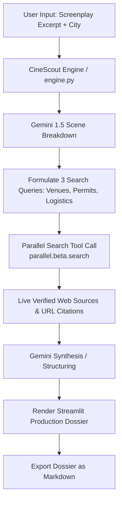

# CineScout: Autonomous Film Pre-Production & Location Agent

> **Built for the Agentic Cinema Hackathon (Parallel Track)**

CineScout is an AI agent that eliminates manual film pre-production overhead. It parses raw screenplay excerpts, analyzes visual and technical scene requirements, and invokes live web search via the **Parallel Search SDK (`parallel-web`)** and **Gemini 1.5 (`google-genai`)** to deliver live, verified location venues, municipal permit regulations, and logistical advisories backed by live source URLs.

---

## 🎬 Core Problem & Solution

- **The Problem:** Film production crews waste dozens of hours manually searching for filming locations, cross-referencing local noise bylaws, and calculating generator/permit requirements from scripts. Generic LLMs hallucinate venues and non-existent municipal permits.
- **The CineScout Solution:** CineScout uses **Gemini 1.5** to break down scene logistics, formulate targeted queries, and invoke **Parallel Search (`parallel.beta.search`)** at runtime to pull live, real-world venue data, permit lead times, and municipal regulations with source citations.

---

## 🛠️ Tech Stack

- **AI Engine:** Google Gemini 1.5 Flash (`google-genai`)
- **Web Search Engine:** Parallel Search API (`parallel-web`)
- **User Interface:** Streamlit (Dual-column interactive dashboard)
- **Environment & Tools:** Python 3.10+, `python-dotenv`, `pydantic`

---

## 🏗️ Technical Architecture



---

## 🚀 Tool Execution Signature

In accordance with Parallel Search SDK requirements, the agent executes search queries via:

```python
from parallel import Parallel

client = Parallel(api_key=PARALLEL_API_KEY)

response = client.beta.search(
    objective=objective,
    search_queries=[query1, query2, query3],
    mode="fast",
    max_results=5
)
```

---

## 📁 Project Structure

```
CineScout/
├── app.py              # Streamlit dashboard UI
├── engine.py           # Gemini 1.5 + Parallel Search SDK tool calling logic
├── requirements.txt    # Project dependencies
├── .env.example        # Template for API keys
├── .gitignore          # Git ignore configuration
├── LICENSE             # MIT License
└── README.md           # Project documentation
```

---

## 💻 Quickstart & Local Setup

### 1. Clone & Navigate to Repository
```bash
cd CineScout
```

### 2. Set Up Environment Variables
Copy `.env.example` to `.env` and fill in your API keys:
```bash
cp .env.example .env
```
In `.env`:
```env
GEMINI_API_KEY=your_gemini_api_key
PARALLEL_API_KEY=your_parallel_api_key
```

*(Note: CineScout includes a fallback mode so the UI remains fully functional even without live keys).*

### 3. Install Dependencies
```bash
pip install -r requirements.txt
```

### 4. Launch the Dashboard
```bash
streamlit run app.py
```

The web dashboard will open automatically at `http://localhost:8501`.

---

## 📄 License
This project is licensed under the MIT License - see the [LICENSE](LICENSE) file for details.
